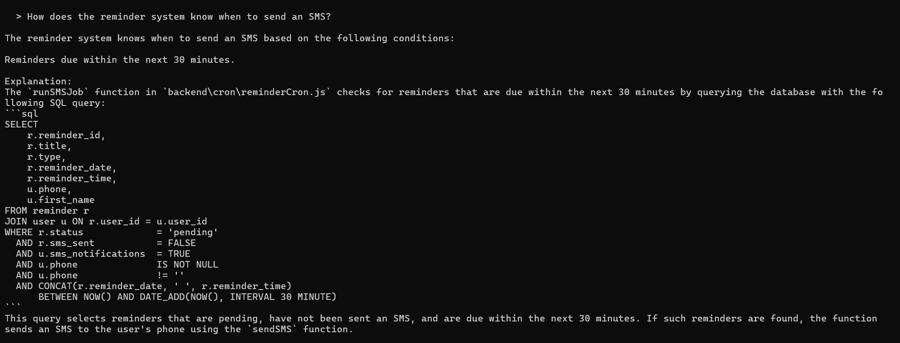
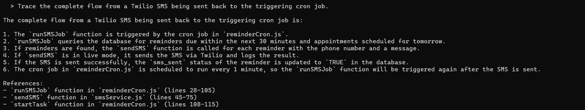
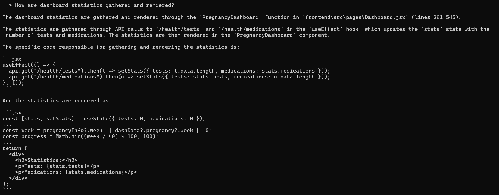

# Code Intelligence System

### A Retrieval-Augmented Generation Engine for Structural Codebase Understanding

---

Modern codebases often contain hundreds of files and thousands of functions, making onboarding and navigation difficult. This project treats a repository as a searchable knowledge base, allowing developers to ask natural-language questions such as:

- "How are JWTs verified?"
- "Trace the reminder scheduling workflow."
- "Where is file upload validation performed?"

instead of manually searching through source files.

## Overview

The Code Intelligence System is a multi-layer pipeline that transforms a raw codebase into a queryable knowledge base. Given any repository, the system parses its structure, maps relationships between symbols, builds a hybrid search index, and answers plain-English questions with grounded, citation-backed responses — without ever reading the entire codebase at inference time.

The core insight driving the design: code has structure that flat text search destroys. Functions call other functions. Classes contain methods. A question about authentication is really a question about a cluster of interdependent symbols. The system is built to exploit that structure at every layer.

---

# Demo

### Natural-language code search

Question:

> How does the reminder system know when to send an SMS?

[ ]

---

Question:

> Trace the complete flow from a Twilio SMS being sent back to the triggering cron job.

[  ]

---

Question:

> How are dashboard statistics gathered and rendered?

[  ]

## Architecture

The system is organized into six discrete, independently testable layers. Each layer has a single responsibility and exposes a clean interface to the next.

```
┌─────────────────────────────────────────────────────────────────┐
│                         User Query                              │
└────────────────────────────┬────────────────────────────────────┘
                             │
                    ┌────────▼────────┐
                    │  Layer 5 + 5.5  │  Query Engine + Expansion
                    └────────┬────────┘
                             │
              ┌──────────────▼──────────────┐
              │          Layer 4            │  Index Manager
              └──────────────┬──────────────┘
                             │
        ┌────────────────────▼────────────────────┐
        │                Layer 3                  │  Embedder
        │         FAISS  ·  BM25  ·  RRF          │
        └────────────────────┬────────────────────┘
                             │
     ┌───────────────────────▼───────────────────────┐
     │                   Layer 2                     │  Call Graph
     │      Symbol Tagging  ·  Edge Extraction       │
     └───────────────────────┬───────────────────────┘
                             │
  ┌────────────────────────  ▼────────────────────────────┐
  │                       Layer 1                         │  AST Parser
  │   Python · JS/TS · Java · C/C++ · HTML · CSS          │
  └───────────────────────────────────────────────────────┘
                             │
                    ┌────────▼────────┐
                    │   Source Repo   │
                    └─────────────────┘
```

---

## Layer 1 — AST Parser (`ast_parser.py`)

**Responsibility:** Parse source files and extract meaningful symbols — functions, classes, methods, and CSS rules — as structured records.

The layer uses `tree-sitter` grammars to parse each file into an Abstract Syntax Tree and walks the tree to extract symbols. Each extracted symbol is a dict carrying its name, kind, parent class (if any), file path, line range, source code, docstring (when present), and language.

Supported languages: Python, JavaScript, TypeScript, Java, C, C++, HTML, CSS.

Language-specific handling covers real-world edge cases: arrow functions and `module.exports` patterns in JS, `member_expression` name resolution, TypeScript-specific grammar nodes, and CSS rule extraction.

**Output:** `symbols.json` — a flat list of symbol dicts. For a typical medium-sized project this runs to a few hundred symbols in under a second.

---

## Layer 2 — Call Graph (`call_graph.py`)

**Responsibility:** Annotate symbols with search tiers and extract caller/callee relationships into a graph.

This layer does two things in sequence.

First, `tag_symbols()` classifies every symbol into one of three search tiers:

- `code` — functions, methods, classes: fully indexed in FAISS + BM25
- `style` — CSS rules: indexed in a lighter separate FAISS index
- `skip` — HTML boilerplate, framework internals: excluded from all indexes

The tier assignment is order-sensitive: `kind` is checked before `language`, which ensures CSS rules (`kind="rule"`) reach the `style` branch rather than being blanket-skipped by the `language="css"` guard.

Second, `build_call_graph()` scans the code of each `code`-tier symbol and records which other symbols it calls, producing an adjacency map `{ display_name: [callee, ...] }`. CSS and HTML symbols are excluded from graph edges since they have no call semantics.

**Output:** `call_graph.json` and an annotated `symbols.json` (with `search_tier` field on every symbol).

---

## Layer 3 — Search Index (`embedder.py`)

**Responsibility:** Build FAISS dense indexes and a BM25 sparse index over the tagged symbol set.

For each `code`-tier symbol, the layer constructs a rich text representation that combines the symbol's kind and display name, its docstring (when available), its file path, its caller/callee names from the call graph, and the first 35 lines of source code. This multi-field document gives the embedding model structural context that a bare function body lacks.

Three indexes are built:

**FAISS (code)** — `IndexFlatIP` over `all-MiniLM-L6-v2` embeddings (384 dimensions, L2-normalized). Exact inner-product search is equivalent to cosine similarity on normalized vectors. Covers all `code`-tier symbols.

**FAISS (style)** — identical construction over `style`-tier CSS symbols, kept separate so the query layer can cite them distinctly.

**BM25** — `BM25Okapi` over camelCase-aware tokenized symbol documents. The tokenizer splits on whitespace and code punctuation, then splits camelCase identifiers (`getUserById` → `get user by id`), giving both exact-name and sub-word matches.

Retrieval uses Reciprocal Rank Fusion (RRF) to merge FAISS and BM25 rankings without normalizing their raw scores:

```
rrf_score(d) = Σ  1 / (60 + rank_i(d))
              i ∈ {faiss, bm25}
```

**Output:** `faiss_code.index`, `faiss_style.index` (optional), `bm25_code.pkl`, `index_meta.json`.

---

## Layer 4 — Index Manager (`index_manager.py`)

**Responsibility:** Orchestrate the build pipeline (Layers 1–3) as a single command and expose a clean `load()` interface to Layer 5.

The `build()` function invokes Layer 1 as a subprocess, then calls Layer 2 and Layer 3 in-process, writing all artifacts to an output directory. It records build metadata (timestamp, model name, symbol counts, graph statistics) in `index_info.json`.

The `load()` function is the single import that Layer 5 calls. It returns `(faiss_code, bm25_code, faiss_style, code_syms, style_syms, call_graph)` — everything needed to answer a query.

Additional utilities: `verify()` checks file presence and FAISS/metadata row-count consistency; `info()` prints a human-readable index summary without loading the full FAISS index.

**Output directory layout:**

```
repo_index/
├── faiss_code.index      ← dense index, code symbols
├── faiss_style.index     ← dense index, style symbols (optional)
├── bm25_code.pkl         ← sparse index, code symbols
├── index_meta.json       ← row → symbol map (consumed by Layers 4 & 5)
├── call_graph.json       ← adjacency map
├── symbols.json          ← full tagged symbol list
└── index_info.json       ← build metadata
```

---

## Layer 5 — Query Engine (`query_engine.py`)

**Responsibility:** Answer a plain-English question by retrieving relevant symbols, expanding context via the call graph, and generating a grounded LLM response.

A query passes through five steps:

**Step 1 — First-pass retrieval.** `embedder.query()` encodes the question, searches FAISS and BM25, and fuses the rankings with RRF, returning the top-K symbols with scores.

**Step 1.5 — Layer 5.5: threshold-gated query expansion** (see below).

**Step 2 — Call-graph expansion.** For each retrieved symbol, the engine follows one hop in both directions (callers and callees) and adds the neighbours to the context set, up to a configurable cap. This ensures the LLM sees not just the function that matched but the functions it depends on and the functions that depend on it.

**Step 3 — Prompt construction.** Each symbol is formatted with a header (kind, name, file, line range) and its source code (truncated at 40 lines). The prompt instructs the model to answer using only the provided code and to cite specific function names and file paths.

**Step 4 — LLM call.** Supports Gemini (`gemini-2.5-flash`) and Groq (`llama-3.1-8b-instant`), with automatic fallback from Gemini to Groq. API keys are loaded from a `.env` file via `python-dotenv`, with shell environment variables taking priority.

---

## Layer 5.5 — Threshold-Gated Query Expansion

**Responsibility:** Detect retrieval failure and re-query with an enriched, repo-aware search string.

This layer activates only when the top RRF score from first-pass retrieval falls below a threshold (default 0.025). A score this low means the best candidate appeared in only one ranker and not at rank 1 — a strong signal that the query vocabulary doesn't overlap with the indexed symbol vocabulary.

When triggered, two expansion passes run sequentially:

**Level 1 — Symbol-name expansion.** Each query token is matched against all symbol names in the index. For every symbol whose name contains a query token, the symbol's name is split (camelCase and snake_case) and its parts are appended to the query.

Example: query contains `phase` → matches `getPregnancyStatus` → appends `get pregnancy status`

**Level 2 — Call-graph neighbour expansion.** The first-pass retrieved symbols are used as seeds. The engine walks one hop in the call graph, splits each neighbour's name into tokens, and appends them.

Example: `getPregnancyStatus` calls `pregnancyRows` → appends `pregnancy rows`

The enriched query is then passed to a second retrieval call. Both expansion levels derive their vocabulary entirely from Layer 1's symbol list and Layer 2's call graph — there are no hardcoded domain terms, so the expansion generalizes to any codebase.

---

## Layer 6 — Evaluation (`eval.py`)

**Responsibility:** Measure retrieval quality against a naive chunking baseline and visualize the gap.

The evaluation framework constructs a test set of (question, expected_symbol) pairs against a known codebase, then measures two metrics:

**Recall@K** — fraction of test queries where the correct symbol appears in the top-K retrieved results, for K ∈ {1, 3, 5}.

**MRR (Mean Reciprocal Rank)** — mean of 1/rank across all queries, where rank is the position of the first correct result. Penalizes systems that find the right answer but bury it.

Both metrics are computed for the full pipeline (FAISS + BM25 + RRF + call-graph expansion) and for a naive baseline (plain text chunking with no structural awareness). Results are plotted with `matplotlib`.

---

## Data Flow Summary

```
Source repo
    │
    ▼ Layer 1 (tree-sitter)
symbols.json            270 symbols, ~0.3s
    │
    ▼ Layer 2 (call graph)
symbols.json            annotated with search_tier
call_graph.json         172 nodes, 103 edges
    │
    ▼ Layer 3 (embedder)
faiss_code.index        223 code vectors × 384 dims
faiss_style.index       CSS rule vectors
bm25_code.pkl           BM25 over camelCase-tokenized docs
index_meta.json         row → symbol mapping
    │
    ▼ Layer 4 (manager)
repo_index/             complete portable bundle, ~12s total build
    │
    ▼ Layer 5 + 5.5 (query engine)
User: "Which database tables determine a user's phase?"
    │
    ├─ first-pass RRF retrieval (top_k=5)
    ├─ score=0.016 < 0.025 → expansion triggered
    │   ├─ L1: "phase" → getPregnancyStatus → appends "pregnancy status"
    │   └─ L2: call-graph neighbours → appends "baby rows active"
    ├─ re-retrieval → getPregnancyStatus surfaces at rank 1
    ├─ call-graph expansion → pulls in callers and callees
    └─ LLM prompt → grounded answer with file citations
```

---

## Tech Stack

| Concern          | Library                                                   |
| ---------------- | --------------------------------------------------------- |
| AST parsing      | `tree-sitter` + language grammars                         |
| Dense retrieval  | `faiss-cpu`, `sentence-transformers` (`all-MiniLM-L6-v2`) |
| Sparse retrieval | `rank_bm25` (BM25Okapi)                                   |
| Fusion           | Reciprocal Rank Fusion (RRF, k=60)                        |
| LLM — primary    | Google Gemini 2.5 Flash                                   |
| LLM — fallback   | Groq `llama-3.1-8b-instant`                               |
| Evaluation       | `matplotlib`, custom Recall@K / MRR                       |
| Config           | `python-dotenv`                                           |

---

## Design Decisions

**Why tree-sitter over regex?** Regex-based extraction breaks on nested structures, multi-line strings, and language-specific edge cases. tree-sitter produces a full parse tree, making extraction robust across all supported languages.

**Why RRF over score normalization?** FAISS returns inner-product scores and BM25 returns TF-IDF-weighted scores — different scales, different distributions. Normalizing them requires assumptions about their distributions that don't hold in practice. RRF fuses rankings rather than scores, making it robust and parameter-free.

**Why a separate style index?** CSS symbols have retrieval value for UI questions but pollute code results for logic questions. Keeping them in a separate index lets the query layer retrieve and cite them distinctly without them competing for the code top-K slots.

**Why threshold-gated expansion rather than always expanding?** Expansion adds tokens that may help on bad queries but add noise on good ones. Gating on the RRF score means fast queries (score already high, right symbols already found) pay zero extra cost, while failing queries get a targeted second attempt.

**Why repo-aware expansion rather than a synonym dictionary?** A hardcoded dictionary encodes domain knowledge about one codebase. The repo-aware approach uses the symbol names and call graph that Layer 1 and 2 already built — the codebase is its own dictionary, and the approach generalizes to any repo without modification.
